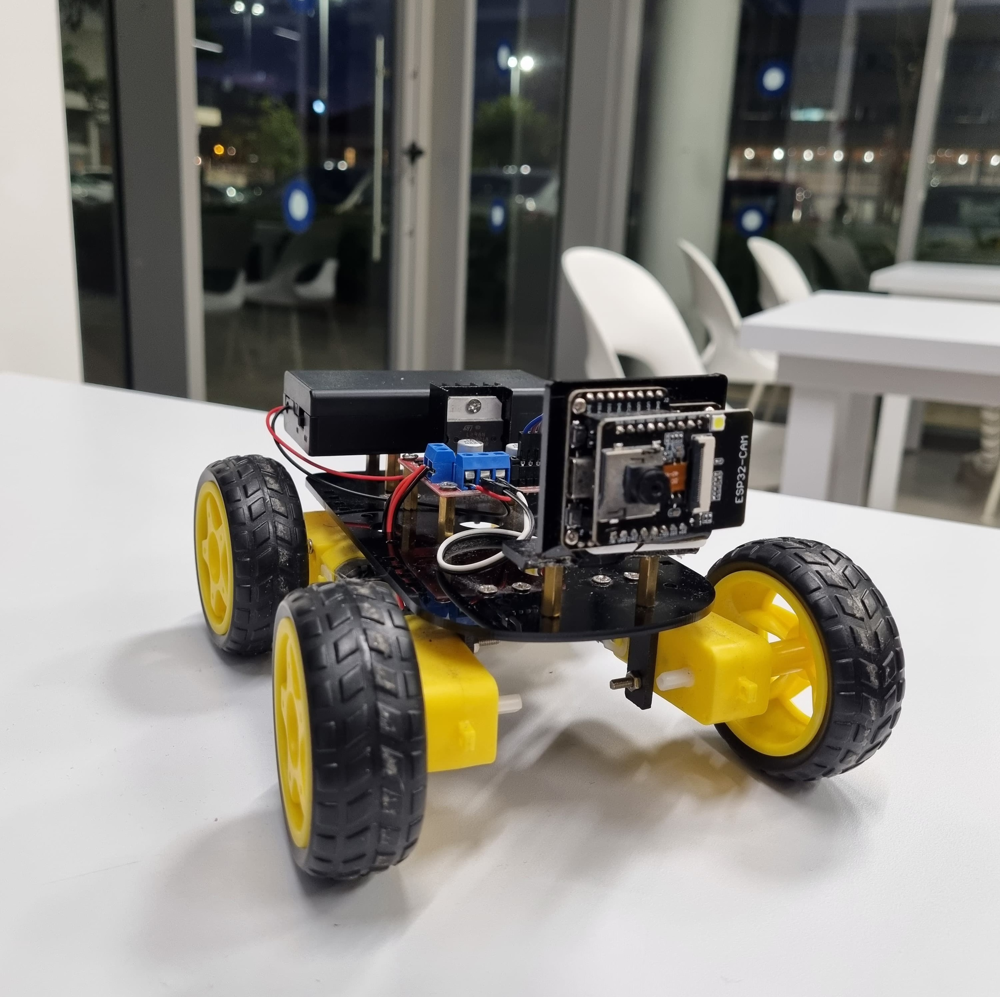

# Virtual Rail Autonomous Vehicle

## Project Overview

This project aims to develop an autonomous line-following car that navigates predefined paths using a computer vision algorithm. The vehicle captures real-time images of the floor using a mounted camera, processes them to detect and track the designated path, and communicates with a web application for navigation and telemetry.

## Key Components

### 1. Vehicle
- **Computation Module and Camera**: Uses an ESP32 camera to capture floor images and a line detection algorithm to process these images.
- **Rail Following Algorithm**: Generates control commands to steer the vehicle based on processed imagery.

### 2. Server
- **Path Finding Algorithm**: Calculates the optimal route for the vehicle from point A to point B.
- **Communication**: Manages requests and responses between the vehicle and the web application.
- **Telemetry Management**: Receives, formats, and stores telemetry data from the vehicle.

### 3. Web Application
- **Road Map Display**: Provides users with a visually captivating interface for navigating routes on the map.
- **User Interaction**: Users can specify the vehicle's final destination and transmit this to the server.
- **Telemetry and Statistics Display**: Shows real-time data and performance metrics of the vehicle.

